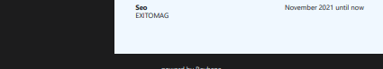
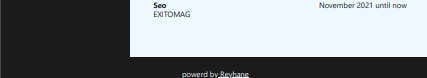

My Awesome Web Project
This is a simple web page I designed with HTML and CSS.

About
A webpage built with HTML and CSS.
Includes a folder yug with the main files:
index.html: The main page.
style.css: The styles for the page.
src/: Additional resources like images or scripts.
How to View
You can see the live page here: Live Demo

How to Run Locally
Clone this repository: git clonehttps://github.com/Reyhane-lsk/Reyhane-lsk-resume-template2
Open yug/index.html in a browser.
Contact
Feel free to reach out if you have questions!
